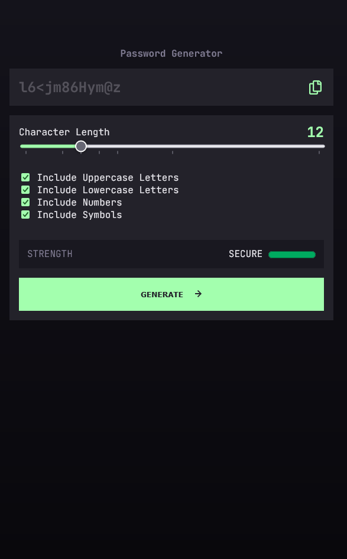

<!-- 
Copyright (c) 2026 Robert A. Howell
Developer: Robert A. Howell
Assets: FrontEnd Mentor provided the font assets, January 2026
-->

# Password generator  
Users should be able to:
- Generate a password based on the selected inclusion options
- Copy the generated password to the computer's clipboard
- See a strength rating for their generated password

Demo URL: [https://securepasswordgeneratordemo.netlify.app/](https://securepasswordgeneratordemo.netlify.app/)  

## What I learned  
Password complexity strength can be scored to measure relative to the available input selections. In effect, more character choices in a password result in a higher complexity score. The length of the generated password compounds multiplies the security effectiveness, too, for better security.  

A chosen password without complex characters requires higher character count to meet the complexity of a shorter complex character password.  

This system functions in the example and is noted as below, to illustrate.  

### Complexity scoring meter  
```html
<meter id="password-strength-meter" min="0" low="380" high="665" optimum="1140" max="1140" value="0">at 25/100</meter>
```

### Complexity scoring function  
```javascript
const calculateComplexityScore = () => {
    complexityScore = 0;

// The complexity score is calculated based on the combination of selected character types. Each
// character type adds a different number of points to the score based on the number of characters
// in the selected set. I.E. [A-Za-z]: 52, [0-9a-z]: 36;

    if (includeUppercaseInput.checked) {
        complexityScore += 26;
    }
    if (includeLowercaseInput.checked) {
        complexityScore += 26;
    }
    if (includeNumbersInput.checked) {
        complexityScore += 10;
    }
    if (includeSymbolsInput.checked) {
        complexityScore += 33;
    }

// Multiply the length of the password to determine the overall strength
    let strengthValue = complexityScore * characterLength

// Set meter value and span text
    strengthValueMeter.value = strengthValue
    setMeterStrengthSpanText(strengthValue);
}
```

    * Each character type adds a different number of points to the complexity score based on the number of characters in the selected set.    
    * The complexity score is multiplied by the length of the password to determine the overall strength.  

## Screenshot  



### Continued development
Compliance documents recommend complex passwords with at least 12 characters. Continued development recommends including unicode characters into new passwords, such as emojis and character symbols.  

## Built for the web  
- Semantic HTML5 markup
- CSS: Grid, Flexbox, styled components
- JavaScript

### Useful resources  

- [Harvard CS50’s Intro to Cybersecurity – Full University Course - YouTube](https://www.youtube.com/watch?v=9HOpanT0GRs) - This article helped me to complete the complexity scoring based on the discussion of password cryptanalysis.
- [&lt;input type=&quot;range&quot;&gt;](https://developer.mozilla.org/en-US/docs/Web/HTML/Reference/Elements/input/range#additional_attributes) - This article details important use cases and attributes.

This is a solution to the [Password generator app challenge on Frontend Mentor](https://www.frontendmentor.io/challenges/password-generator-app-Mr8CLycqjh). Frontend Mentor challenges help you improve your coding skills by building realistic projects.  
